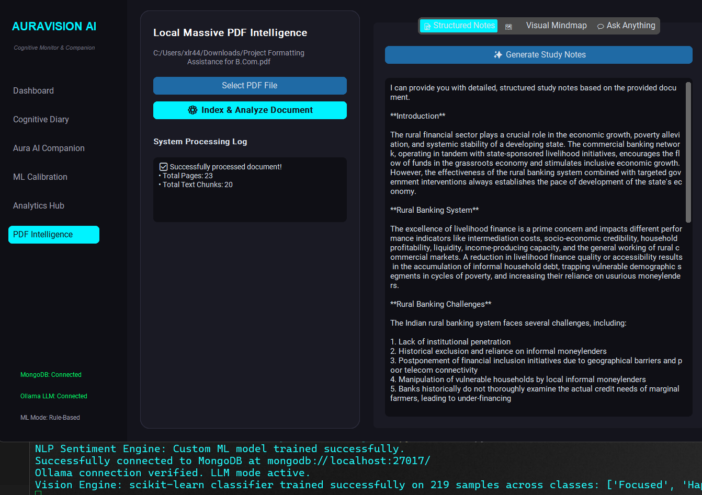
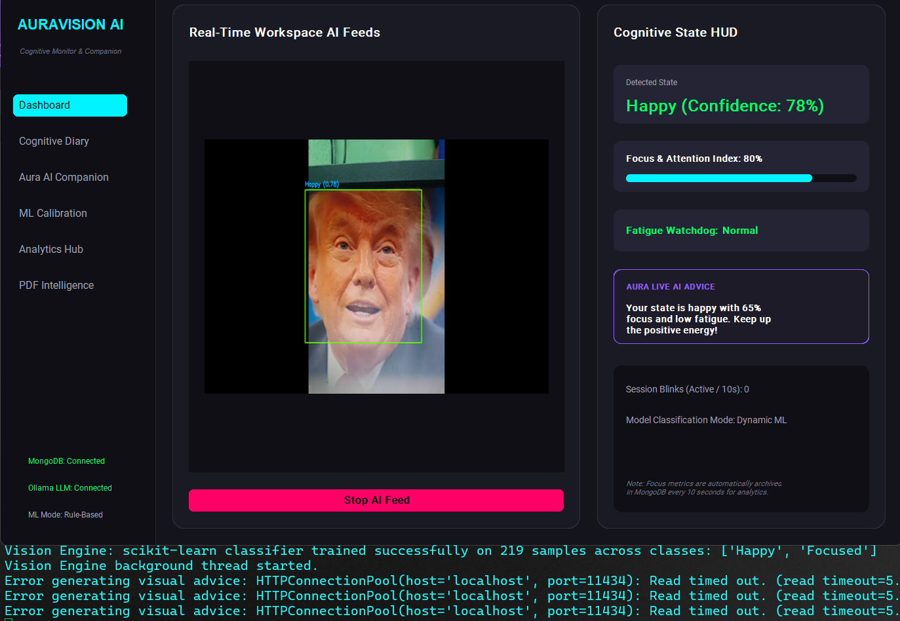
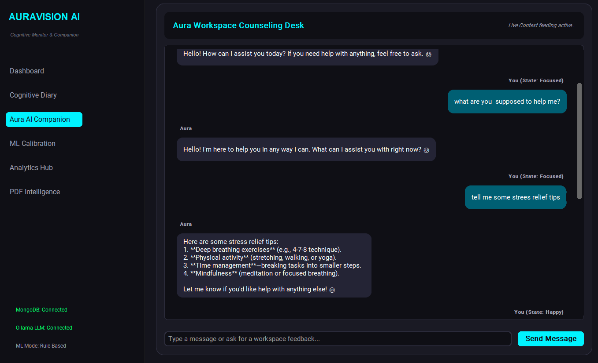
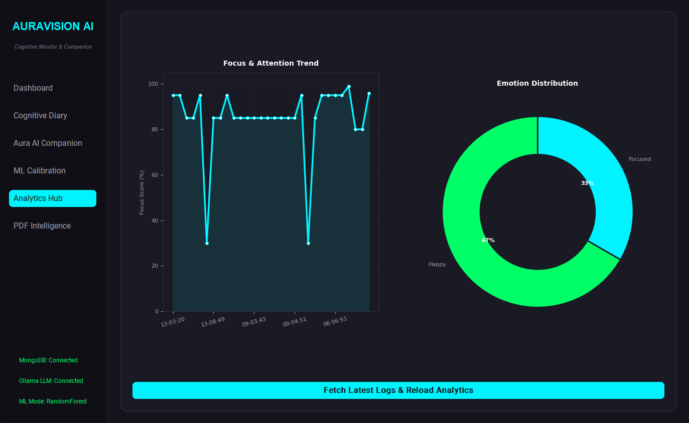
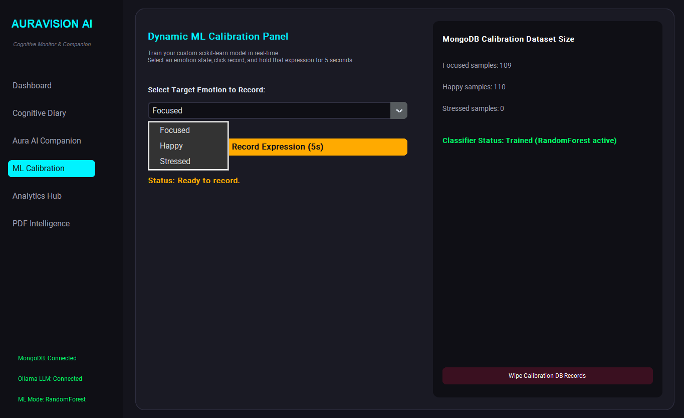
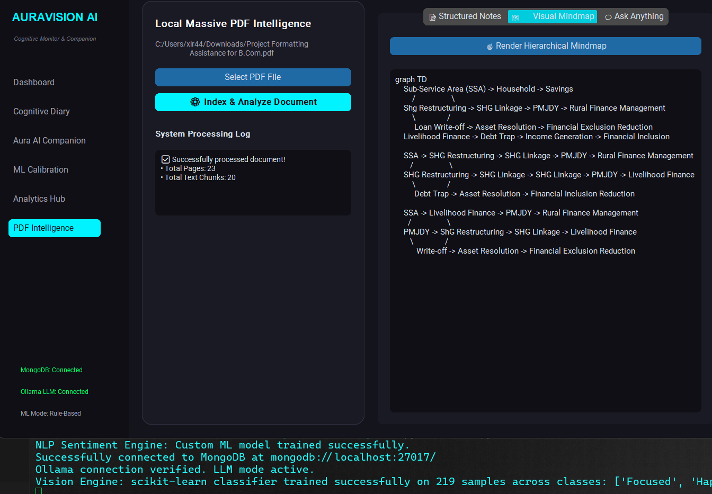
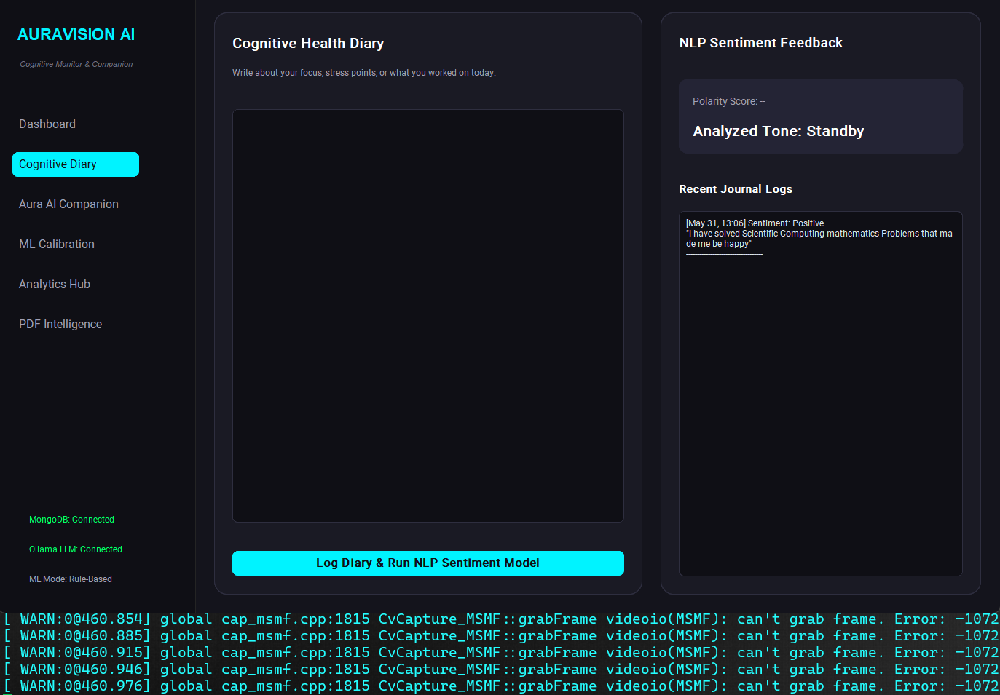

# AuraVision: AI-Driven Cognitive Health & Workspace Analytics Suite.

AuraVision is a state-of-the-art desktop workspace monitoring and cognitive support application. Built as an advanced final-year academic project, it combines **Computer Vision (CV)**, **Natural Language Processing (NLP)**, and **Generative AI** in a high-tech dark GUI dashboard to optimize productivity and mental health during study or work sessions.






---

## 🚀 Key Features

*   **Multi-Modal Cognitive Dashboard**: Live webcam monitoring showing facial boundaries, tracking attention focus, and detecting eye blinks to identify fatigue.
*   **On-the-Fly ML Classifier Calibration**: Train a custom **scikit-learn RandomForest Classifier** in real-time. By capturing facial ratios for 5 seconds per emotion state (Focused, Happy, Stressed), the model adapts specifically to the user's facial geometry.
*   **Cognitive Diary with NLP Sentiment Analysis**: An interactive text editor that runs a locally trained TF-IDF & Logistic Regression pipeline to extract sentiment score polarity and automatically saves entries to MongoDB.
*   **Empathetic AI Workspace Counselor**: A chat workspace linked to local **Ollama LLM** (e.g. `llama3`) or a custom state-based dialog fallback. The companion receives real-time facial expressions and diary sentiments to personalize its support tone (e.g., soothing if stressed, concise if focused).
*   **Visual Analytics Hub**: Interactive graphs powered by **Matplotlib** embedded in the GUI, showing historical focus score trends and pie/donut charts of emotion distribution.
*   **Persistent MongoDB Backend**: Schema structure for user logs, chat histories, diaries, and calibration feature vectors.
*   **Local PDF Intelligence**: Extract text from massive PDFs, generate study notes, build Mermaid.js visual mindmaps, and chat directly with your document using local vector embeddings (Local RAG).

---

## 🛠️ Technical Stack & Architecture

```
                       ┌───────────────────────┐
                       │  CustomTkinter GUI    │
                       └───────────┬───────────┘
                                   │
         ┌─────────────────────────┼─────────────────────────┐
         ▼                         ▼                         ▼
┌──────────────────┐      ┌──────────────────┐      ┌──────────────────┐
│  Vision Thread   │      │    NLP Engine    │      │   AI Companion   │
│ (OpenCV + scikit-│      │  (scikit-learn   │      │ (Ollama / Local  │
│  learn RF Model) │      │  TF-IDF + LR)    │      │  Fallback Dial)  │
└────────┬─────────┘      └────────┬─────────┘      └────────┬─────────┘
         │                         │                         │
         └─────────────────────────┼─────────────────────────┘
                                   ▼
                       ┌───────────────────────┐
                       │   MongoDB Backend     │
                       │ (pymongo Local Server)│
                       └───────────────────────┘
```

*   **GUI Framework**: CustomTkinter
*   **Webcam CV**: OpenCV (`opencv-python`)
*   **Machine Learning**: `scikit-learn`, `numpy`
*   **Database**: MongoDB (`pymongo`)
*   **Plotting**: `matplotlib`
*   **Generative AI**: Ollama Local API (`llama3` or `mistral`)
*   **PDF Processing**: `pypdf`, `numpy`

---

## 📋 System Prerequisites

1.  **Python 3.12+**
2.  **MongoDB Local Server**: Ensure MongoDB is running on your system (`localhost:27017`). The app will automatically connect to it and initialize a database named `auravision_db`.
3.  **Ollama (Optional but Recommended)**: 
    *   Download and run [Ollama](https://ollama.com/).
    *   Pull your preferred model (e.g. `ollama pull llama3`).
    *   If Ollama is offline or model is missing, the app seamlessly falls back to the **Aura Smart Dial Engine** which uses rule-based emotional counseling so that the app is 100% functional out-of-the-box.

---

## 📦 Project File Structure

*   `main.py`: Main execution script, sets up CustomTkinter frames, styles, widgets, and navigation tabs.
*   `database.py`: Interface managing connections and CRUD operations for MongoDB logs, chats, journals, and calibration data.
*   `vision_engine.py`: Captures webcam feeds asynchronously, processes Haar Cascades, extracts eye ratios/smile width, and contains the retrainable RandomForest classifier.
*   `nlp_engine.py`: Pre-trained TF-IDF vectorizer + Logistic Regression pipeline running local sentiment analysis on journal diary text.
*   `ai_companion.py`: Handles Ollama API requests with system prompts or triggers local keyword-canned fallback counselors.
*   `charts.py`: Custom wrapper classes mapping Matplotlib plot nodes inside Tkinter widgets.
*   `pdf_app.py`: Core logic for extracting text from PDFs, generating vector embeddings, and communicating with Ollama for study notes, mindmaps, and document Q&A.

---

## ⚙️ How to Run the Project

1.  **Clone / Copy the codebase** into a workspace directory.
2.  **Ensure MongoDB is started**:
    *   On Windows, check that the MongoDB Service is active in task manager, or run `mongod` in a terminal.
3.  **Run the application**:
    ```bash
    python main.py
    ```

---

## 👤 User Instructions & Workflow

1.  **Start AI Feed**: On the **Dashboard**, click `Start AI Feed` to initialize your camera monitoring. The system will start analyzing your eye blinks and using the default rule-based model to evaluate your attention.
2.  **Calibrate Your ML Classifier**: Go to the **ML Calibration** tab.
    *   Select "Focused" and click `Record Expression (5s)`. Look at the camera with your normal working expression.
    *   Select "Happy" and click `Record Expression`. Smile at the camera.
    *   Select "Stressed" and click `Record Expression`. Look stressed or squint your eyes.
    *   *Upon saving the second class, the RandomForest classifier instantly trains in the background.* The status will change to "RandomForest Active".
3.  **Write in the Cognitive Diary**: Go to the **Cognitive Diary** tab, write your daily logs, and click `Log Diary & Run NLP Sentiment Model`. The model will output positive/negative/neutral labels, color-code the card, and log the record in MongoDB.
4.  **Chat with Aura**: Open the **Aura AI Companion** tab. The chat uses context (your current webcam state and your latest diary sentiment) to talk with you.
5.  **Review Performance**: View the **Analytics Hub** to observe real-time focus fluctuations and your daily mood frequencies.
6.  **Analyze Documents**: Navigate to the **PDF Intelligence** tab, upload a PDF, and index it. Generate study notes, view visual mindmaps, or ask specific questions about the document in the local RAG chat.

## RAG Mindmap Generation (Without Internet)


## Model Training (Calibration)

